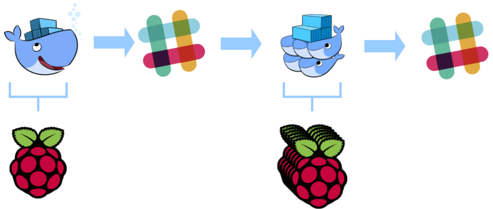

# Docker on Pi
## or How I Learned to Stop Worrying and Love the ARM

By now, most people have heard of the [Raspberry Pi](https://www.raspberrypi.org/). It's a moderately-powered, barebones computer, but when you take into account the specs (1.7 GHz processor, 1G of RAM) and its pricetag (somewhere around 60US for full functionality) it becomes an __insanely__ powerful computer at its pricepoint.

Bearing that in mind, somewhere deep in the bowels of the DevOps dungeon at Excella the wheels started turning in the head of my boss, Dave Bock, and he wondered what would happen if you could leverage that insanely cheap computing power and turn it into a computational cloud. So one day, he dropped a bunch of hardware and some ideas onto a table in the DevOps Hall of Doom and asked the team if they would consider figuring out a way to run his math project on it. A colleage had already bit into this project, and it was already well underway when I started here at Excella, just a couple of weeks ago. So, being new and eager to impress, I glommed on quickly to make sure I could spend my time before I got shipped out to a contract actually being (instead of just looking) busy. Luckily, there was already the rough outline of a plot that consisted of:


1. Deploy Docker Swarm on the Raspberry Pis
2. Run Dave Bock's latin squares finder

More on latin squares:

[](http://www.youtube.com/watch?v=VgNN8iokc54)


Coming into this project my only experience with Docker was that it was a cool way to make my [Molecule](http://molecule.readthedocs.io/en/latest/) builds run faster, and I was vaguely aware that Travis-CI supported it, and it was the new hotness. I was also excited to jump into this new tech after hearing glowing reviews.

[Docker Swarm](https://docs.docker.com/engine/swarm/) is the native answer to highly available systems that use the power of Docker containerization. Swarm joins several nodes together, administered by one or more managers, and spins up Docker containers to support services, which are Docker containers running with certain redundancy, restart, and load-balancing properties managed by the Swarm. That seemed like it'd be a great candidate to jam into a Pi and watch it work.


After working and thinking about this for a while we decided that we had three major goals:

1. Automate the swarm deployment
2. Figure out a cool way to interact with Dave's script
3. Deploy from a pipeline


## Part 1 - Making Pis with My Babay
### Sizing up the Beast
In my former life, before Excella, I had been working with enterprise headless servers for the last 7 years of my career, so I was no stranger to plugging some purposefully anonymous piece of hardware into a network and coaxing it into starting to talk with the rest of its neighbors. That said, I don't think I really knew what to expect from the goofy little stack of metal and plastic when I first laid eyes on it. It was just row of blinking lights and exposed circuitry to look at. It had a measly little switch hanging off its side, and a couple of power supplies that I could only describe as "cell phone appropriate." But Raspberry Pis are supposed to be a create-your-own computer/sever with all of the bells-and-whistles stripped out. It was more than a bit of a culture shock to realize that the BIOS systems and PXE (yes PXE!) fell into that category of things Pis can do without. Most of the hardware configuraitons are built right into the `/boot` partition of the OS, and these things boot so fast, I don't think it would even have time to recognize the ol' F12 keypress at the boot screen anyway.

So what the Pi gains in customizablity, it doesn't necessarily add in scalability for provisioning. But for me, this was great. The problem was outlined: how do you automate building a Raspberry Pi Docker Swarm from cradle to grave?

### Avahi Discovery
Enter [Avahi](https://www.avahi.org/). Most OS X users are likely familiar Avahi without even realizing it. It's what things like iTunes and printers use to advertise their services on local networks. From the amazing [Archwiki](https://wiki.archlinux.org/index.php?title=Avahi)

>Avahi is a free Zero-configuration networking (zeroconf) implementation, including a system for multicast DNS/DNS-SD service discovery. It allows programs to publish and discover services and hosts running on a local network with no specific configuration. For example you can plug into a network and instantly find printers to print to, files to look at and people to talk to. It is licensed under the GNU Lesser General Public License (LGPL).

Raspbian actually starts Avahi when it boots, and it advertises SSH so long as the service is enabled to run when booting. This provided an important window into a type of auto-provisioning, and since it could be leveraged by simple scripts, I whipped up a little inventory creation stanza in my [Ansible](https://www.ansible.com/):

```yaml
- name: Go discover all of the hosts
  hosts: swarm_master
  become: True
  tasks:
  - name: set the hostname
      hostname:
        name: swarmaster

    - name: Restart avahi service
      command: service avahi-daemon restart

    - name: Apt update to install avahi-utils
      apt:
        name: avahi-utils
        update_cache: yes

    - name: Go discover all of the raspberry pis
      shell: >
        avahi-browse -a -t | awk '/IPv4 raspberrypi/ { print $4 }'
      register: avahi_discovered_pis
      changed_when: False

    - name: For each of the pis discovered, add it to the swarm_host group
      add_host:
        name: "{{ item }}.local"
        groups: swarm_hosts
      with_items: "{{ avahi_discovered_pis.stdout_lines }}"
      changed_when: False
```
__Note__: Only the hostname for the swarm master is set. The logic is that the master will run all of the Ansible, and it's the only unique host in the bunch. Therefore all of the swarm master configurations can be pointed at `localhost`. Avahi needs to play games with advertisements when multiple hosts have the same name. So new hosts get a `-n+1` added to their hostname. But these can also change randomly. Setting the hostname for the first node overcomes this problem for the master node, and the rest of the nodes are all configured as swarm hosts in the same way [*].

After that all of the necessary configuration to install docker, set up the swarm, is fully automated, and can be found in [GitHub](https://github.com/champain/raspbian_swarm) (shameless plug).

This simplifies the startup process and makes it repeatable. Any developer should be able to

1. Write the OS to SD cards
2. Install the SD cards to the Pis
3. Attach networking
4. Power on the Pis
6. `git clone https://github.com/champain/raspbian_swarm`
5. `scp -r raspbian_swarm pi@raspberrypi.local:`
6. `ssh pi@raspberrypi.local`
6. `source setup.sh`

Finally, run the playbook

```bash
ansible-playbook \ 
	-i inventory playbooks/main.yml \
	-k \
	--vault-password-file .vault_pass.txt
```

Once that is complete, a fully-functional Docker Swarm is up and running!

### It's not really that simple, is it?
That's all it takes, but it's also worth pointing out the archtecture of this particular repo.

#### Roles
For starters, all of the configuration is pulled in from `playbooks/main.yml`. This single point of entry for all nodes in the cluster make repeating ansible runs much simpler. From there a batch of common tasks are run across all nodes, and these are organized into a role `common`. And there are separate roles for both the swarm master and the swarm hosts.

```bash
├── roles
│   ├── common
│   │   ├── tasks
│   │   │   └── main.yml
│   │   └── templates
│   │       └── hosts.j2
│   ├── swarm_host
│   │   ├── handlers
│   │   │   └── main.yml
│   │   └── tasks
│   │       └── main.yml
│   └── swarm_master
│       ├── tasks
│       │   └── main.yml
│       └── templates
│           └── config.j2
```

#### Inventory
The inventory is notable in this case because it's been pre-populated with a `swarm_hosts` group which has no nodes

```yaml
swarm:
  children:
    swarm_master:
      hosts:
        swarmaster:
          ansible_host: localhost
          ansible_connection: local
    swarm_hosts:
```
This provides the backbone for the Avahi host discovery. Once hosts are discovered, they are placed into the `swarm_hosts` group.

#### Secure vars
There are two secrets included in this repo in the form of encrypted group_vars. There are two API keys for interacting with slack that need to be decrypted at run time, and should not be sent to GitHub in the clear. They're also referenced in the clear in a non-encrypted `group_vars` file like so

```yaml
rswarm_mols_api_key: "{{ secure_rswarm_mols_api_key }}"
rswarm_mols_hook_key: "{{ secure_rswarm_mols_hook_key }}"
```
To be perfectly honest, further work could be done on variablizing much more of this, but sane defaults were implemented everywhere possible.


## Up and Running Now What?

One of the most interesting and nuanced things about the Raspberry Pis are their [ARM processors](https://www.arm.com/products/processors) when run on, of course, the [ARM CPU architecture](https://en.wikipedia.org/wiki/ARM_architecture). This is interesting for our purposes because not all software is written to run on ARM processors. Sure, interpreted languages like Python and Ruby are going to work just fine... as long as you can compile their interpreters on the Raspberry Pis! But what about other things that normally come as precompiled packages from repos for x86 architectures? And specifically, what about [Crystal](https://crystal-lang.org/) the language for the interesting little script Dave wanted us to roll out to the Pis?

### Crystal? Is that you?
Well, the answer is: it depends. In the case of Crystal, we eventually [lucked out](https://stackoverflow.com/questions/42796143/how-do-i-install-crystal-lang-on-rapsberry-pi) and found someone nice enough to have compiled Crystal for us who was hosting it on a [public repo](http://public.portalier.com/raspbian). (This may be a good time to point out that several of the practices we relied on during this project were not exactly production-ready). This ended up saving a lot of time and effort. While the Pis can do certain things very well, compiling new software doesn't seem to be one of them, and simple builds for things like Ruby (as we learned later) can take a very, very long time.

So, installing Crystal on Raspberry Pi turned out to be as simple as

```bash
echo "deb http://public.portalier.com raspbian/" > /etc/apt/sources.list.d/crystal.list
curl "http://public.portalier.com/raspbian/julien%40portalier.com-005faf9e.pub" | sudo apt-key add -
```
and then

```bash
sudo apt-get update
sudo apt-get install crystal
```

Well, that was the case until we actually tried to compile our script. It turns out there are a couple more libraries to get up and running before Crystal will do anything useful on ARM. The eventual setup turned out to be:

```bash
echo "deb http://public.portalier.com raspbian/" \
> /etc/apt/sources.list.d/crystal.list && \
curl "http://public.portalier.com/raspbian/julien%40portalier.com-005faf9e.pub" | apt-key add - && \
sudo apt-get update && \
sudo apt-get install \
  libbsd-dev \
  libedit-dev \
  libevent-core-2.0-5 \
  libevent-dev \
  libevent-extra-2.0-5 \
  libevent-openssl-2.0-5 \
  libevent-pthreads-2.0-5 \
  libgmp-dev \
  libgmpxx4ldbl \
  libssl-dev \
  libxml2-dev \
  libyaml-dev \
  libreadline-dev \
  automake \
  libtool \
  git \
  llvm \
  libpcre3-dev \
  build-essential \
  crystal -y
```

Then, we were finally able to run `crystal build mols2.cr` in our Raspberry Pi and run it. This also became important later as we were looking for ways to pipeline this project.

#### Math is Hard

Then we promptly crashed our Pi. Almost as soon as we ran a computation larger than 9 the load on the Pi shot up to 12 and the tough little computer used up all of its available memory. It turns out that the intensive memory and CPU power necessary to figure out just what we were asking could easily eat up more that a G of memory and peg one of the cores on the machine until it OOM-killed the process. Again, for what you pay, the Raspberry Pi is a beast of a machine, but it's still underpowered compared to most laptops out there.

### Bugs!


One of the first things that we noticed when working with our ARM-based swarm is that we could not actually start up services. They would stay in a `pending` state forever. So we stepped back a little and just started containers with `docker run`, and the containers themselves would run fine. We were even quickly able to overcome architecture-based issues by pointing to containers that had already been built to work with ARM like `alexellis2/visualizer-arm:latest` from the [Docker Hub](https://hub.docker.com/r/alexellis2/visualizer-arm/), but our services would remain in a pending state.

After pounding our heads against the table for a couple of hours over this, the team finally stumbled across a [bug report](https://github.com/docker/swarmkit/issues/2294) that described our issue to a T. It turns out that the architecture our worker nodes were reporting as looked something like:

```
OSType: linux
Architecture: armv7l
```

But the images we needed to use from the Docker Hub were less specific and might look something like

```
OSType: linux
Architecture: arm
```

Meaning that as long as Docker was checking its images, it would reject any of the worker nodes as candidates for image deployment. The workaround was simple conceptually: add `--no-resolve-image` to each `docker service create` command and manually download the image for the service on each node. Practically, and for our plans to automate software deployment, this would become an issue. If we couldn't get Docker Swarm to resolve the images, then the `docker service update` command wouldn't go fetch the latest image for us. We put this in our back pocket for the time being, having solve the immediate issue of swarming our nodes and deploying a service to them.

### Efficient Allocation of Resources


What swarm did get for us, though was a way to limit resources devoted to a container. Where before we were seeing nodes dropping out of the Swarm like, uh well, flies when asked to run our computational software, we could instruct Docker to limit the impact of the entire container via the `--limit-cpu` flag to `docker service create`. Soon we were firing up 6 replicas at a time of our software, and started getting output to `docker service logs` that looked like

```
latin_squares.0.fv4hpnyoy02vj96r9jvtc9drk@swarmost4    | A0 B1 C2 D3 E4 F5 G6 H7 I8 J9
latin_squares.0.fv4hpnyoy02vj96r9jvtc9drk@swarmost4    | B6 F0 E1 C7 J3 G4 H5 D8 A9 I2
latin_squares.0.fv4hpnyoy02vj96r9jvtc9drk@swarmost4    | C4 G8 D5 I0 F1 B9 J7 E6 H2 A3
latin_squares.0.fv4hpnyoy02vj96r9jvtc9drk@swarmost4    | D7 A5 B0 G2 I9 H3 E8 C1 J6 F4
latin_squares.0.fv4hpnyoy02vj96r9jvtc9drk@swarmost4    | E3 J2 F8 B5 A6 I7 C9 G0 D4 H1
latin_squares.0.fv4hpnyoy02vj96r9jvtc9drk@swarmost4    | F2 D9 G3 J8 H0 C6 I1 A4 E5 B7
latin_squares.0.fv4hpnyoy02vj96r9jvtc9drk@swarmost4    | G9 C3 I6 H4 B8 D1 A2 J5 F7 E0
latin_squares.0.fv4hpnyoy02vj96r9jvtc9drk@swarmost4    | H8 I4 A7 E9 C5 J0 F3 B2 G1 D6
latin_squares.0.fv4hpnyoy02vj96r9jvtc9drk@swarmost4    | I5 H6 J4 A1 G7 E2 D0 F9 B3 C8
latin_squares.0.fv4hpnyoy02vj96r9jvtc9drk@swarmost4    | J1 E7 H9 F6 D2 A8 B4 I3 C0 G5
```

Which was great for us. We were leveraging the swarm to compute large Latin squares and getting lots of unique entries, but there was one huge problem. No one else could see what we were doing!

### This sounds like a job for ChatOps
Like a lot of companies Excella uses [Slack](https://slack.com/) for in-house chat communication. I've been a fan of Slack's [Incoming Webhooks](https://api.slack.com/incoming-webhooks) for some time, and I'd even had some experience writing a bots in Python to do some simple responding and tell some jokes. Since we were looking to share our results with others, and were spending time copying and pasting our results into Slack anyway, this seemed like the natural next step in having our software just do the Slacking for us.

After creating the [incoming webhook integration](https://my.slack.com/services/new/incoming-webhook/), the first iteration of the latin squares solver with Slack integration just spawned `curl` as an attempt to connect to the Slack API, and it promptly crashed every node it was run on! Spawning the additional system resources each time `curl` needed to be called was far too taxing, and besides, a native solution from Crystal was already waiting in [HTTP::Client](https://crystal-lang.org/api/0.20.1/HTTP/Client.html). Here's the resultant simple Slack notifier written in Crystal

```ruby
def notify_slack(webhook_url, channel, username, text, icon_emoji)
  payload = {
    :channel => channel,
    :username => username,
    :text => text,
    :icon_emoji => icon_emoji
  }.to_json
  HTTP::Client.post(webhook_url, headers: HTTP::Headers{"User-agent" => "MolsApp", "Content-Type" => "application/json"}, body: payload) do |response|
    puts response.body_io.gets
  end
end
```

With a little more effort devoted to parsing the output into one JSON object, the eventual script took its [current form](https://github.com/champain/mols_container/blob/master/mols2.cr) as an on-demand tool that could be used to generate latin squares of any size (in practice nothing larger than 10). This was a powerful concept, because it meant that we could deploy a custom version of this tool each time we issued a new `docker service create` command.

#### Another Bot
In terms of interaction, this got us halfway there. We were able to show the fruits of our labors, but no one was able to actually interact with the latin squares generator or the cluster of Pis sequestered 4 floors away in a tiny office without walking downstairs, plugging their laptop into a switch, and `ssh`ing into the master node to start issuing commands.

We decided on creating another bot with the ability to eavesdrop on our Slack conversations. This bot would have access to the Docker Swarm running on the master, and it would spin up the containers with the latin squares Crystal script on demand whenever a user issued it the correct command. Writing the bot was fairly simple, based on the fantastic [Slack-Ruby-Bot](https://github.com/slack-ruby/slack-ruby-bot), it ended up just being a few lines of code run with a Slack API token set as an environment variable. It also was responsible for providing the webhook API key to the latin squares compute.
Those environment variables turned out to be easy to send via `docker run` with the `-e` flag, and eventually made their way into the Anisble code you might remember from above.

```yaml
rswarm_mols_api_key: "{{ secure_rswarm_mols_api_key }}"
rswarm_mols_hook_key: "{{ secure_rswarm_mols_hook_key }}"
```
The final step was to make sure that this container, when run, would mount the UNIX socket where Docker was listening on the swarm master. So with the following, we were able to get a bot up and running that would listen to commands to generate latin squares, and then would fire up a new container anywhere in the swarm to do the processing. Starting the bot was as easy as


```bash
docker run \
        -d \
        --name {{ mols_bot_name }} \
        -e SLACK_API_TOKEN={{ rswarm_mols_api_key }} \
        -e MOLS_SLACK_API_KEY={{ rswarm_mols_hook_key }} \
        --mount type=bind,src=/var/run/docker.sock,dst=/var/run/docker.sock \
        {{ mols_bot_image }}
```

Once the container is up and running, there is now a bot to play with in Slack.


With that the circle is complete. The Docker container with the bot logs into slack, that sends instructions to the Docker Swarm, and those results get posted to Slack.



This handled the first two of the teams' objectives fairly succinctly.

1. Automate the swarm deployment
2. Figure out a cool way to interact with Dave's script

The swarm was up and running, and the entire process was sitting in GitHub in Ansible. Also, we now had a way we could show off this tool and all the hard work we did to our colleagues.

But that third objective was still just a twinkle in the team's eye. Since we're DevOps, we knew that continuous deployment was always the goal, but how could we get a pipeline going on a group of Raspberry Pis sitting not in the cloud or a fully-managed colo, but just a desk in what used to be someone's office?

## MacGyvering the Pipeline

It was a good question, and one where limiting factors, and our relatively small means just made for better DevOps drama.


### ARMing Ourselves

The primary problem with figuring out a pipeline would be to create a system that could get our Pis to respond to GitHub hooks without having an endpoint on the publicly available Internet. Initially we figured that the only way Docker images and our apps could be built is if they were built on the Pis. Our biggest breakthrough came when we realized that even x86 processors could be made to emulate ARM architecture through the magic of [QEMU](https://www.qemu.org/). This enabled us to leverage the really cool, powerful, and free(!) [Travis-CI](https://travis-ci.org/) to build our Docker images and compile our tools.

Since we on the Internet stand on the shoulders of giants, we lucked across a blog from [Hypriot](https://blog.hypriot.com/) that showed us [exactly what we needed to do](https://blog.hypriot.com/post/setup-simple-ci-pipeline-for-arm-images/). It turned out that the solution itself was also wrapped in a Docker container, making the key to success simply adding

```bash
docker run --rm --privileged multiarch/qemu-user-static:register --reset
```

to our build scripts. Our ability to build Docker images within Travis really changed the game, and the resultant configurations turned out to be forthright, and refreshingly simple for both the [latin squares solver](https://github.com/champain/mols_container/blob/master/.travis.yml) and the [ruby chatbot](https://github.com/Nykke/mols_slack_bot/blob/master/.travis.yml). They took on the following form.

```yaml
script:
  - docker run --rm --privileged multiarch/qemu-user-static:register --reset
  - docker build -t champain/latin_squares .
  - docker run -e "BUILD_TESTING=BUILD" champain/latin_squares 3 https://hooks.slack.com/services/nottheapikey
```

#### Encrypting Docker Hub Credentials

The other side of this coin was getting these Docker images into a place where the Raspberry Pi could go fetch them. Docker Hub was a prime candidate, but required a login. Travis [supports environment variables](https://docs.travis-ci.com/user/environment-variables/) and by installing the [Travis Rubygem](https://github.com/travis-ci/travis.rb), those environment variables can be encrypted, written to the `travis.yml` in a repo, and used to log into the Docker Hub.

```bash
$ travis encrypt DOCKER_PASS=facemoney
Detected repository as champain/mols_container, is this correct? |yes| yes
Please add the following to your .travis.yml file:

  secure: "LbpxVHGXNg40TKM81bd4+2CIWT9MrLGeX7zHuxPilGRn9v4seVH8e8TiSo27Hy06Hk6zwpuxjqu5WQLokqMqU7ybYpwbHFLjFD+/3KoJwq2Uqel6eh1v7aNFtpW8AyRAg0+PhdjlfEA81Z2ZALdIrxRHqpo2tpoUNSpkBA2qPqY0UKDCRSiNl2zqlOXKyfgzjKc1VXZ77boZ3lXrs7gowZri/xCki+HidTdkuAqUOCvXiAuhU62ikfMtBsbSt8CcSNHn3wNLC3+T+HSs0YDL8sXjgInF1Yi2T7jJyRvIin+r4nvJ7vFLZ7B0kn7SOSnjK4PGgOr6ptlmU3h++RsRzMDkeI/gE98TIXcEJmzreetfXeB78n+lhEn/6thU10z8xrgMHUHjLzCEp8NHTLgSZo1DyQXFYMBUIS4QS4Bt6H9x/7O79IXgj4DZUSzDaUKiKZhvPQh/xu++DOY7ulgaC+4oVygbWwKRU830dFWf5zhl7GrpNeWQ3nKpliDJqCBtU5PFU3HkacObAKBqIKxp/2ZR4ib9JyWTT6usnkkw6dtIpilscn3lm3RxvWItz+5U+1wXHByjRGUsXptWcXFvnYANzh+CsWy0gGcHCqdawkJuz6SF4HU+vbwPeB6kcq0v1j8EXeiAiv4+k9+yV07+Q4CJmYfo8jIGuLEVnXMJPqY="
```

__Note__: not my real Docker Hub password.

From there, a simple script to push the image on success and when on the `master` branch was added.

```yaml
after_success:
  - > 
      if [ "$TRAVIS_BRANCH" == "master" ] && [ "$TRAVIS_PULL_REQUEST" == "false" ]; then
          docker login -u="$DOCKER_USER" -p="$DOCKER_PASS"
          docker tag champain/latin_squares champain/latin_squares:latest
          docker push champain/latin_squares:latest
          docker push champain/latin_squares
      fi 
```
This left us with the full `.travis.yml` as

```yaml
sudo: required
services:
  - docker
language: bash
env:
  global:
    - secure: "tYzjoqiqPFLhEGOW7AMeImepOJrIJ8IgskZZTDZidi4yNbicN67FrBntRRJAuk6y0JJ3RQXeQqWggnujsxeOrPnflFUpC6uSpH42IPGPcCXpA/a/oH1vNSOhN8MpAw7+vND9FTpcp+idgeC4noy2uPRVA3DE3JJuWxC+emPz9ErE/ObsPrIfhvVK2jEmn6getv46/cDIvTw7FzpjooxpoSpffHwgO91Ry88SeUrc6VWw1KsghASmoGwAez0wCZHFn0eQfa5nSuqfeLfqXVEgf7YQJ3gNOQhiBU8nwhqzXNZgyCGTb9+mvQtM2oju8STkyVFcIQJhpQIJcXtEuBqtr8mn5LxLaIOcd4rOZxOrqYwTxA0DafHqGIAlgQoO/Nyw07jjaocmJ68EO6p8RC50JIlQkg52PUEOklujpSyFhQ/M8/mWlvGsliV2DAawb1mfRyvS8huFAREDTfSteIyrZiS3fWHDmBjUgJHRhAXc0aMWQ+fxLcSdXrowe9hTuvDGzllnqWpSt6BejT8/o3N+5WmAqEJM91k5TWsSVZj1w7zLRqjVDeyBirkeMcZf2+xrUdJNFvlY6gBz0bN4msUEqZQcoa4IzX9+BPDC7cwaWEhvoD9WzgSTeLrDGyWoEmLIzzDoMnXHY3eCdo1JVKd4UdGN+6+dGHxOLLeholX2FtY="
    - secure: "s6kBp0yi+RwiF0Qrmmq89EkpOXLOQo9B6drs4QJ3+yYkdZsJDMLHIJ7E9G80V9LcuP0ykuwtZctFHgKtgsnNYN+A33Lk+c7CcH7mBc1SQADdIkD3CHX4xilyMBzGADtQWqBwnnzAyWPRidIfozYMHup/OYIABKaudvIXPUcznzGA/KLQSOEXQcOjff06SblLBvtwzGGPvyQa3a0QrPRFTtAwLjW/SP11v/Nk1ZChr9gCMfAmsmzwVxzSzlauatdKCsdjhEwJ2hN3MqICpwS/IlvC4gjx0H1C0JboX1EXv+6aOMSjJ5FqU3t5ZNwNqkDGshgxlmq2p3+KkX/wx5si5h4/8wZF+gDwfKXCCDobGxUbtYL4Fps9sP3bOSWUJY1kqRShu1rsHrlF6qCO9iahZJdM2G/2ONeRSn9jnTi9Ws2VEMWokDSp85d8olHMbWAukxR+DneV78srZaAtSRutH1jIkYDRKmww4rR1L3ouwhixreMEp33912Ia6shR6sakc24P6ZLBAlyNNEBwa00GergHuPXVrS9x6kPLsjrkV5jb5lOZx0EwEQQFtcBO1NrI737s+obs1htAA9prNTbgs5172ucShyNwpZY6bgCBmHWCFybJC5x10gZUpst4ZInHeRgTuoyce2Cyocg+hKP7R8MiTqPIJTSaSqxq8gQBqII="
script:
  - docker run --rm --privileged multiarch/qemu-user-static:register --reset
  - docker build -t champain/latin_squares .
  - docker run -e "BUILD_TESTING=BUILD" champain/latin_squares 3 https://hooks.slack.com/services/nottheapikey
after_success:
  - > 
      if [ "$TRAVIS_BRANCH" == "master" ] && [ "$TRAVIS_PULL_REQUEST" == "false" ]; then
          docker login -u="$DOCKER_USER" -p="$DOCKER_PASS"
          docker tag champain/latin_squares champain/latin_squares:latest
          docker push champain/latin_squares:latest
          docker push champain/latin_squares
      fi 
```

The result is a consistently auto-build Docker image that gets pushed up to my [Docker Hub](https://hub.docker.com/r/champain/latin_squares/) on every success.

### Dockerfiles and Ruby

One other little snag we hit was that the version of Ruby we were working with was not available on Raspbian. There were a couple of images out there on the Internet that had older versions of Ruby running on ARM architecture, but most of these were woefully out of date. It was time to again tax our little Pis with a big CPU-intensive task, this time, it was building Ruby. The following Dockerfile became the basis for the build for the chatbot.

Start with Raspbian Jessie

```
FROM resin/rpi-raspbian:jessie
```

Do some housekeeping

```

RUN apt-get update \
	&& apt-get install -y --no-install-recommends \
		bzip2 \
		ca-certificates \
		curl \
		libffi-dev \
		libgdbm3 \
		libssl-dev \
		libyaml-dev \
		procps \
		zlib1g-dev \
	&& rm -rf /var/lib/apt/lists/*
```

Go fetch Ruby and some dependencies. 

```
ENV RUBY_MAJOR 2.4
ENV RUBY_VERSION 2.4.0
ENV RUBY_DOWNLOAD_SHA256 152fd0bd15a90b4a18213448f485d4b53e9f7662e1508190aa5b702446b29e3d

# some of ruby's build scripts are written in ruby
# we purge this later to make sure our final image uses what we just built
RUN buildDeps=' \
		autoconf \
		bison \
		gcc \
		libbz2-dev \
		libgdbm-dev \
		libglib2.0-dev \
		libncurses-dev \
		libreadline-dev \
		libxml2-dev \
		libxslt-dev \
		make \
		ruby \
	' \
	&& set -x \
	&& apt-get update \
	&& apt-get install -y --no-install-recommends $buildDeps \
	&& rm -rf /var/lib/apt/lists/* \
	&& mkdir -p /usr/src/ruby \
	&& curl -fSL -o ruby.tar.gz "http://cache.ruby-lang.org/pub/ruby/$RUBY_MAJOR/ruby-$RUBY_VERSION.tar.gz" \
```

Check and unpack the tarball

```
	&& echo "$RUBY_DOWNLOAD_SHA256 *ruby.tar.gz" | sha256sum -c - \
	&& tar -xzf ruby.tar.gz -C /usr/src/ruby --strip-components=1 \
	&& rm ruby.tar.gz \
```
Build Ruby

```
	&& cd /usr/src/ruby \
	&& autoconf \
	&& ./configure --disable-install-doc \
	&& make -j"$(nproc)" \
	&& make install \
	&& rm -r /usr/src/ruby \
	&& apt-get purge -y --auto-remove $buildDeps

```
Install [Bundler](http://bundler.io/)

```
# skip installing gem documentation
RUN echo 'gem: --no-rdoc --no-ri' >> /.gemrc

ENV GEM_HOME /usr/local/bundle
ENV PATH $GEM_HOME/bin:$PATH
RUN gem install bundler \
  && bundle config --global path "$GEM_HOME" \
  && bundle config --global bin "$GEM_HOME/bin"

# don't create ".bundle" in all our apps
ENV BUNDLE_APP_CONFIG $GEM_HOME
CMD ["irb"]
```

To interact with this container be sure to run it with `-it` to start a TTY and let Docker know this is an interactive session. This will drop the user into an `irb` shell using the version of Ruby in the Dockerfile. This image was pushed manually up to [Docker Hub](https://hub.docker.com/r/nykke/ruby_raspbian/), so that it could become the basis for the chat bot, and part of builds.

### Chat Bot Builds
Chat bot builds were relatively straightfoward once the Ruby container was built. Here it's referenced in the chat bot [Dockerfile](https://github.com/Nykke/mols_slack_bot/blob/master/Dockerfile)

```
FROM nykke/ruby_raspbian
```

And then Travis is configured to build that Docker image and push it to the Docker Hub.

```
sudo: required

language: ruby
# rvm:
#   - "2.4.0"

services:
  - docker

env:
  global:
    - DOCKER_USER=nykke
    - secure: "Y5v9Y9o7UNHj/hpWRLZVtq/RWliae6PbWN5CDHbXKeO5N0jZppNIx1n35haH+CPjtfTXnm9Tj2Oq8NShIZiBGsskSWaykaxiEgAtWvepe1JoTRf1+BKIgVPLCx2Ne8BCI+Uy5p7M15TCbqqfgbBieYSOVC7QBLNjEidQjfY6YiCEdW2q2JqrflenjDGK5bkvpSiLht/vyW6RXENNpvKQLSj0rgce4KpNIplI/Zdx0eqnjLN0R5H5u/vxEeJ8ycUsEYxCw2Ue4/uEsVLoX++FQXC8UPrD2clkTec8IA3cuIO1sdj8sxEMdkBkcwM4FMsNR/wrsb/6qObsDq7UvTw/cY7Q/85RYXvaXi0JymNZm/OAwHtvX7zwnrcAZGFZzbXrLslqM5YQKhR6s/sJSY6q1gYBDXkBxKFulgXwtbTwxVXCYgPiCvCf1P3jZHqzVtBaN3/hgGetWOeHFFBwoZ4LOSb3trfCHWDAXji1JKxUq1a7Fev2heasfgvVu5jgivyYrZUZ/q1831kcNa2fBQdVvZTEXiqc4ULvrEXIFabvcSdmgIuXlA3+LCdBOxKarAzm0Uy9Fnyb4lye0TuHBaTJMsHpuDIwFBGjZS/+uJMLcFygFQJYOIByAyn2hCM0LjVoReKkDxx55CaLi6wMUPlx+1ifGESreib38RvS5HW7wbU="

script:
  - docker run --rm --privileged multiarch/qemu-user-static:register --reset
  - docker build -t nykke/mols_bot_raspbian .

after_success:
  - >
      if [ "$TRAVIS_BRANCH" == "master" ] && [ "$TRAVIS_PULL_REQUEST" == "false" ]; then
          docker login -u="$DOCKER_USER" -p="$DOCKER_PASS"
          docker tag nykke/mols_bot_raspbian nykke/mols_bot_raspbian:latest
          docker push nykke/mols_bot_raspbian:latest
          docker push nykke/mols_bot_raspbian
      fi
```

### The Last Piece of the Puzzle

Astute readers will recall from the section on "Bugs!" that Docker Swarm on ARM has the unfortunate inability to update automatically. So the native `docker swarm update` was not going to work in our case, though it does seem particularly powerful when it's working.

Instead, it was determined to drop the chat bot from services, and just run it as a container with `docker run`. This allowed us to use [Watchtower](https://github.com/v2tec/watchtower) to update our running container whenever an image for one running was published to the Hub. Again, Ansible was used to roll this out. This time, in an effort to keep things as up to date as possible, old versions would be removed, and redeployed on subsequent Ansible runs.

```yaml
- name: Check to see if Watchtower is running
  shell: "docker container inspect watchtower | grep Running  | grep true"
  register: rswarm_watchtower_container
  changed_when: False
  ignore_errors: True

- name: Stop Watchtower if it's running
  command: docker container stop watchtower
  when: rswarm_watchtower_container.rc == 0

- name: Remove Watchtower
  command: docker container rm watchtower
  when: rswarm_watchtower_container.rc == 0

- name: Deploy Watchtower
  command: >
          docker run \
                  -d \
                  --name watchtower \
                  -v /var/run/docker.sock:/var/run/docker.sock \
                  talmai/rpi-watchtower 6
```

Once Watchtower was up and running, any new image we pushed to the Hub would automatically get deployed, and the container restarted on the master node in the Docker Swarm.

The only other trouble was getting all of the nodes to pull the latest image for the latin squares solver. This was accomplished with good 'ol Cron.

```yaml
# This is a cheap workaround to this
# https://github.com/docker/swarmkit/issues/2294
# bug. When the figure it out we should be able to
# stop doing --no-resolve-image in our service creates
- name: Create a cron to pull latest docker images
  cron:
    name: "Pull the latest mols image"
    minute: "*/5"
    job: "docker pull champain/latin_squares:latest"
```

### The Whole Picture

Putting this all together now, we can see that we've finally accomplished what we set out to do. There is an automated Swarm setup, that deploys an interesting way to interact with the latin squares generator, and it's completely automated in terms of deployment.

It looks a little something like this.


And all of that is running on a bunch of Raspberry Pis that look a little something like this


Bonus angle


#### Into the Sunset
The cool thing about softwar development is that there is always some improvement, something else we could do. My time on this project is drawing to a close, but I can definitely say that those of us who worked on it are leaving it in a state that anyone can pick up and run with. Some of the features we'd like to see fleshed out if anyone cares to take a crack at it are:

* Rspec testing for our Ruby
* Acceptance testing for our Crystal
* [Network Booting the Pi](https://www.raspberrypi.org/documentation/hardware/raspberrypi/bootmodes/net_tutorial.md)
* Ansible Role for Docker Swarm
* Figuring out what's wrong with 2x2 squares


## Thanks and Acknowledgements

I'd like to thank all of my colleagues for their contributions especially Justin for putting up with me in the early days and Nyketha for putting up with me in the latter days. I'd like to extend a speciall thanks to Dave Bock for supplying the hardware, more hardware, even more hardware, and the software. I'd also like to thank [Excella](https://twitter.com/ExcellaCo) for prompting me to do this blog post and caring enough about learning to make this project possible.
